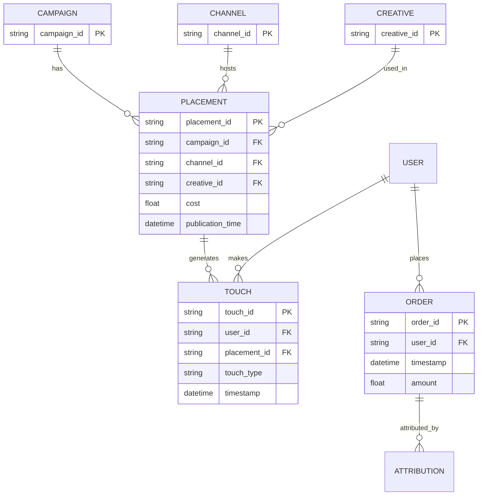

# Data Model — Поступашки

Единый источник правды. Все артефакты строго по этим колонкам.

---

## Три уровня знания (главный принцип кейса)

### 🟢 Знаем (факты из данных)
- 795 строк продаж, 606 покупателей, 18 курсов, 04.08–10.09.2026
- `student_id` — хеш от Telegram username
- `timestamp` = момент покупки = момент выдачи доступа
- Один `student_id` может иметь несколько покупок
- Один `timestamp` + один `student_id` = один заказ (даже если курсов несколько)

### 🟡 Оцениваем (модели и допущения)
- Attribution: last_touch / linear / time_decay, окно = 7 дней
- ROMI_attr — по attribution-модели
- ROMI_inc — через ITS (Task 7), не через attribution
- Классификация постов: sale / discount / launch / native / content
- Стоимость размещений — синтетическая (реальных данных нет)

### 🔴 Нельзя узнать из текущих данных
- Реальные marketing costs по каждому размещению
- Реальные касания до 4 августа
- Внутренние переписки менеджеров
- Атрибуция organики (пришли сами — не из рекламы)
- Incrementality без эксперимента / holdout

**Что нужно начать логировать:**
- `start_param` в tracking link → `user_id`
- `publication_time` + `cost` для каждого placement
- `conversation_started` при первом сообщении менеджеру
- Все sale / discount посты автоматически

---

## Сущности и владельцы

| Файл | Владелец | Потребляет |
|---|---|---|
| `data/orders.csv` | Разраб №1 | Разраб №2 (ROMI) |
| `data/order_items.csv` | Разраб №1 | — |
| `data/daily_metrics.csv` | Разраб №1 | Аналитики |
| `data/ad_registry.csv` | **Разраб №2** | Разраб №1 |
| `data/touches.csv` | **Разраб №2** | Разраб №1 (attribution) |
| `data/attribution_results.csv` | Разраб №1 | **Разраб №2** |
| `data/romi_by_campaign.csv` | **Разраб №2** | Аналитики |
| `data/romi_by_placement.csv` | **Разраб №2** | Аналитики |

---

## Схемы

### ad_registry.csv
| Колонка | Тип | Описание |
|---|---|---|
| placement_id | str | PK, `pl_XXX` |
| campaign_id | str | FK, `cmp_X` |
| channel_id | str | FK, `ch_XX` |
| channel_name | str | Имя канала |
| creative_id | str | FK, `cr_X` |
| cost | float | ₽ |
| publication_time | datetime | |
| data_source | str | `synthetic` |

### touches.csv ⚠️ синк с Разрабом №1
| Колонка | Тип | Описание |
|---|---|---|
| touch_id | str | PK, `t_XXXXXX` |
| user_id | str | `u_XXXXX` |
| touch_type | str | click \| bot_start \| lead |
| campaign_id | str | FK |
| placement_id | str | FK |
| creative_id | str | FK |
| timestamp | datetime | |
| start_param | str | `c_<cmp>_p_<pl>_cr_<cr>` |
| data_source | str | `synthetic` |

### attribution_results.csv 🔴 от Разраба №1
| Колонка | Тип |
|---|---|
| order_id | str |
| user_id | str |
| revenue | float |
| campaign_id | str |
| placement_id | str |
| creative_id | str |
| model | str (last_touch \| linear \| time_decay) |
| attributed_revenue | float |
| window_days | int |

### romi_by_campaign.csv
`campaign_id, model, attributed_revenue, cost, romi_attr, romi_inc, orders_count`

### romi_by_placement.csv
`placement_id, campaign_id, channel_name, model, attributed_revenue, cost, romi_attr, romi_inc, orders_count`

---

## User Stitching (Task 4)

```
Канал А → tracking link → Telegram user → менеджер → payment
```

**Механизм:**
1. Пользователь кликает по ссылке `t.me/<bot>?start=c_<cmp>_p_<pl>_cr_<cr>`
2. `tracking_bot.py` ловит `start_param` и пишет `(user_id, start_param, timestamp)`
3. `user_id` = Telegram ID (анонимный числовой)
4. При первом сообщении менеджеру — тоже логируется `conversation_started` с тем же `user_id`
5. При оплате — `student_id` (хеш username) связывается с `user_id` через mapping-таблицу

**Если deterministic stitching невозможен:**
- Используем **probabilistic** по времени: если `bot_start` был в течение 24ч до оплаты и других касаний не было — считаем атрибуцию
- Если несколько кандидатов — распределяем `linear`

**Ограничения:**
- Не используем персональные данные
- `user_id` — числовой, `student_id` — хеш. Прямая связь запрещена политикой

---

## ER-диаграмма



---

## Правила

1. Схему не меняем без синка всех 4.
2. `data_source` обязателен: `real` / `synthetic` / `collected`.
3. Attribution window = 7 дней.
4. Один заказ = `(student_id, timestamp)`. Пакет = несколько курсов с одним timestamp.